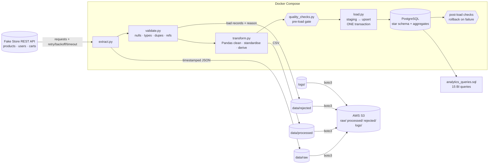

# Cloud-Based API → Data Warehouse ETL Pipeline

[](.github/workflows/ci.yml)


A production-style ETL pipeline that pulls e-commerce data (products, customers, carts) from a public REST API,
validates and transforms it with Pandas, loads it **incrementally** into a PostgreSQL **star schema**, archives raw and
processed data locally and on **AWS S3**, enforces **data-quality gates**, and ships as a **Docker** application.

**Source API:** [Fake Store API](https://fakestoreapi.com) – free, no key. Business use case: sales analytics for an online
retailer (revenue trends, customer lifetime value, category mix, basket analysis, customer segmentation).

---

## Architecture



```
 REST API ─► Extract ─► Validate ─► Transform ─► Quality gate ─► Load (1 txn) ─► Post-load checks ─► Commit
                │          │            │                              │                │
                ▼          ▼            ▼                              ▼                ▼
            data/raw   data/rejected  data/processed             PostgreSQL        etl_run_audit +
                └──────────────┴───────────┴──────► AWS S3 ◄── logs/        data_quality_results
```

### Star schema

```
                   dim_date
                      │ date_key
 dim_customer ── fact_sales ── dim_product
 customer_key     (cart_id, product_key)    product_key
                  grain = 1 cart line
 agg_daily_sales · agg_category_sales · agg_customer_summary   (analytics-ready, rebuilt every load)
 etl_run_audit · data_quality_results · etl_watermark          (pipeline metadata)
```

### Key design decisions

| Concern | Decision |
|---|---|
| Resilience | Exponential back-off + jitter on timeouts / connection errors / 429 / 5xx; `Retry-After` honoured; 4xx fail fast |
| Incremental load | `etl_watermark` (max order date) → `startdate` API filter with a configurable look-back; `--full-refresh` ignores it |
| Duplicate prevention | `UNIQUE (cart_id, product_key)` + `INSERT … ON CONFLICT DO UPDATE … WHERE row changed` → idempotent re-runs, no write amplification |
| Atomicity | Dimensions + fact + aggregates + post-load checks run in **one transaction**; any failure rolls everything back |
| Bad data | Rejected rows keep the raw record and the reason(s); a reject-ratio threshold aborts runaway bad loads |
| Security | `password` is redacted before the raw zone; S3 uses SSE; secrets only via env; container runs as non-root |
| Observability | Pipeline, error and per-run execution logs; run audit table; persisted data-quality results; logs shipped to S3 |

---

## Folder structure

```
api-data-warehouse-etl/
├── data/{raw,processed,rejected}/    # pipeline artefacts (git-ignored)
├── logs/                             # pipeline.log · error.log · execution_<run_id>.log
├── src/
│   ├── config.py                     # env-driven settings
│   ├── logger.py                     # console + rotating file + per-run logs
│   ├── extract.py                    # API client, retries, raw JSON
│   ├── validate.py                   # null/type/dup/required/ref checks, rejects
│   ├── transform.py                  # Pandas cleaning + star-schema frames
│   ├── database.py                   # engine, schema bootstrap, audit, watermark
│   ├── load.py                       # staging + idempotent upserts
│   ├── s3_upload.py                  # boto3 uploads, partitioned keys
│   ├── quality_checks.py             # pre/post-load data quality
│   └── pipeline.py                   # orchestration
├── sql/
│   ├── schema.sql                    # DDL: PK, FK, indexes, checks
│   ├── refresh_aggregates.sql        # analytics-ready tables
│   └── analytics_queries.sql         # 15 business queries
├── tests/                            # pytest: API, validation, transform, DQ, S3, e2e
├── docs/PROJECT_GUIDE.md             # GitHub metadata, resume bullets, 20 interview Q&As
├── .github/workflows/ci.yml
├── Dockerfile · docker-compose.yml · Makefile
├── requirements.txt · requirements-dev.txt
├── .env.example · .gitignore · pytest.ini
└── main.py
```

---

## Quick start (Docker – recommended)

```bash
git clone <your-repo-url> api-data-warehouse-etl && cd api-data-warehouse-etl
cp .env.example .env            # set POSTGRES_PASSWORD (S3 stays off for now)
docker compose up -d postgres   # start the warehouse
docker compose run --rm etl     # run the pipeline (incremental)
docker compose run --rm etl --full-refresh
```

Inspect the warehouse:

```bash
docker compose exec postgres psql -U etl_user -d sales_dwh -c "SELECT * FROM agg_category_sales;"
docker compose exec -T postgres psql -U etl_user -d sales_dwh < sql/analytics_queries.sql
```

CLI flags: `--full-refresh` · `--skip-s3` · `--init-db-only` · `--log-level DEBUG`.

> **Linux bind-mount permissions:** the container runs as UID 1000. If `data/` or `logs/` are owned by another user,
> run `chmod -R a+rwX data logs` once (or set `user:` on the `etl` service).

## Local (no Docker for the app)

```bash
python -m venv .venv && source .venv/bin/activate
pip install -r requirements-dev.txt
cp .env.example .env            # POSTGRES_HOST=localhost
docker compose up -d postgres
python main.py
```

## AWS S3 setup

1. **Create a private bucket** (block public access, default encryption on):
   ```bash
   aws s3api create-bucket --bucket <your-etl-bucket> --region ap-south-1 \
     --create-bucket-configuration LocationConstraint=ap-south-1
   aws s3api put-public-access-block --bucket <your-etl-bucket> \
     --public-access-block-configuration BlockPublicAcls=true,IgnorePublicAcls=true,BlockPublicPolicy=true,RestrictPublicBuckets=true
   ```
2. **Least-privilege IAM policy** for the pipeline user/role:
   ```json
   {
     "Version": "2012-10-17",
     "Statement": [
       { "Effect": "Allow", "Action": ["s3:ListBucket"], "Resource": "arn:aws:s3:::<your-etl-bucket>" },
       { "Effect": "Allow", "Action": ["s3:PutObject"], "Resource": "arn:aws:s3:::<your-etl-bucket>/api-dwh/*" }
     ]
   }
   ```
3. **Configure `.env`:** `S3_ENABLED=true`, `S3_BUCKET=<your-etl-bucket>`, `AWS_REGION`, and credentials
   (`AWS_ACCESS_KEY_ID` / `AWS_SECRET_ACCESS_KEY`) – or run on EC2/ECS with an IAM role and leave them empty.
4. *(Optional)* lifecycle rule: transition `raw/` to Glacier after 90 days, expire `logs/` after 180 days.
5. *(No AWS account?)* `docker compose --profile s3-local up -d localstack`, then `S3_ENDPOINT_URL=http://localstack:4566`.

S3 layout (Hive-style partitions, ready for Athena/Glue):

```
s3://<bucket>/api-dwh/raw/products/dt=2026-10-06/products_20261006T101500123456Z.json
s3://<bucket>/api-dwh/processed/fact_sales/dt=2026-10-06/fact_sales_….csv
s3://<bucket>/api-dwh/rejected/products/dt=2026-10-06/products_rejected_….csv
s3://<bucket>/api-dwh/logs/dt=2026-10-06/execution_<run_id>.log
```

## Configuration

All settings are environment variables – see [`.env.example`](.env.example). Highlights: `API_MAX_RETRIES`,
`API_TIMEOUT_SECONDS`, `LOOKBACK_DAYS`, `MAX_REJECT_RATIO`, `FAIL_ON_QUALITY_ERROR`, `S3_FAIL_ON_ERROR`.

## Data quality checks

| Stage | Check |
|---|---|
| Validation | required fields · nulls/blank · data types · ranges · e-mail format · duplicate keys · referential (cart → user/product) |
| Pre-load | record-count reconciliation (`input = valid + rejected`) · reject-ratio threshold · processed schema · null/duplicate keys |
| Post-load (in txn) | warehouse schema · loaded-row counts · duplicate business keys · orphan FKs · non-positive measures · `line_total = qty × price` · aggregate-to-fact revenue reconciliation |

Every result is written to `data_quality_results`; any `FAIL` rolls the load back and marks the run `FAILED` in `etl_run_audit`.

## Testing

```bash
pytest -m "not integration"        # unit tests – no DB, no AWS (S3 mocked with moto)
make test-integration              # end-to-end against PostgreSQL (TEST_DATABASE_URL)
```

Covers: retries/timeouts/redaction (`test_extract`), validation rules (`test_validate`), transformations and dimensions
(`test_transform`), data-quality logic (`test_quality_checks`), S3 key layout/SSE (`test_s3_upload`), and idempotent
incremental loads + rollback behaviour (`test_pipeline_integration`).

## SQL analytics examples

Full set of 15 queries: [`sql/analytics_queries.sql`](sql/analytics_queries.sql).

```sql
-- Monthly revenue with month-over-month growth
WITH monthly AS (
  SELECT d.year_month, SUM(f.line_total) AS revenue
  FROM fact_sales f JOIN dim_date d ON d.date_key = f.date_key
  GROUP BY d.year_month)
SELECT year_month, revenue,
       ROUND(100.0 * (revenue - LAG(revenue) OVER (ORDER BY year_month))
             / NULLIF(LAG(revenue) OVER (ORDER BY year_month), 0), 2) AS mom_growth_pct
FROM monthly ORDER BY year_month;

-- Top 3 products per category
WITH pr AS (
  SELECT p.category_display AS category, p.title, SUM(f.line_total) AS revenue
  FROM fact_sales f JOIN dim_product p ON p.product_key = f.product_key GROUP BY 1, 2),
ranked AS (SELECT *, ROW_NUMBER() OVER (PARTITION BY category ORDER BY revenue DESC) rn FROM pr)
SELECT * FROM ranked WHERE rn <= 3;
```

| # | Business question | Techniques |
|---|---|---|
| 1 | Monthly revenue & MoM growth | CTE, LAG |
| 2 | Top customers & share of revenue | JOIN, DENSE_RANK, window SUM |
| 3 | Category revenue mix | JOIN, GROUP BY, window SUM |
| 4 | Top 3 products per category | CTE, ROW_NUMBER |
| 5 | Running total & moving average | window frames |
| 6 | Average order value by month | CTE, AVG |
| 7 | Customer spend quartiles | CTE, NTILE |
| 8 | One-time vs repeat customers | CTE, CASE |
| 9 | Day-of-week / weekend pattern | JOIN, window SUM |
| 10 | Price-tier performance | JOIN, aggregation |
| 11 | Frequently bought together | self-join, CTE |
| 12 | Customer recency / churn risk | CTE, CROSS JOIN, CASE |
| 13 | Ratings vs sales | JOIN, window SUM |
| 14 | City revenue Pareto | CTE, RANK, running SUM |
| 15 | Pipeline health & DQ trend | JOIN, FILTER, JSONB |

## Screenshots

| | |
|---|---|
|  *placeholder: pipeline run output* |  *placeholder: star-schema ERD (pgAdmin / dbdiagram)* |
|  *placeholder: S3 partitions* |  *placeholder: `data_quality_results` query* |

## Limitations & next steps

- Source API has no change feed; incrementality is driven by cart date + look-back, deletes upstream are not propagated.
- `unit_price` uses the product price at load time (the API exposes no historical prices); a Type-2 `dim_product` would fix this.
- Natural next steps: orchestrate with Airflow/MWAA or EventBridge + ECS, Parquet + Athena for the S3 zone, dbt for the SQL layer, Great Expectations for richer profiling.

## Resume-ready description

> Designed and built a containerised ETL pipeline (Python, Pandas, SQLAlchemy, PostgreSQL, Docker, AWS S3) that ingests
> REST API data with retry/back-off, validates and quarantines bad records, loads an incrementally-updated star schema
> inside atomic transactions, enforces automated data-quality gates, archives raw/processed data and logs to S3, and
> exposes analytics-ready tables plus 15 business SQL queries; covered by a pytest suite and GitHub Actions CI.

More (repo description, topics, commit messages, 3 resume bullets, 20 interview Q&As): [`docs/PROJECT_GUIDE.md`](docs/PROJECT_GUIDE.md).
